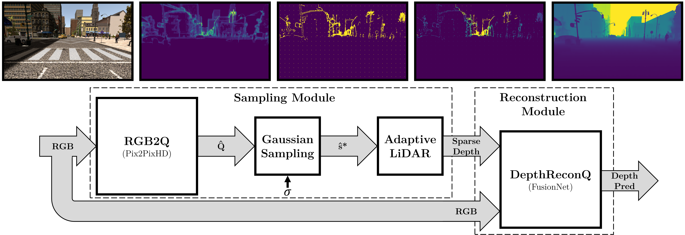
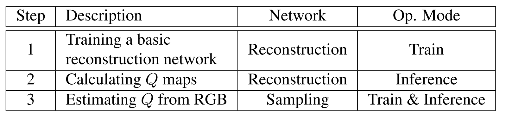
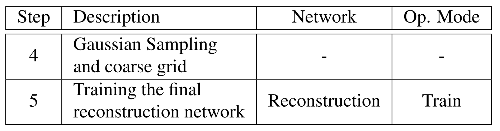

# How to Guide Adaptive Depth Sampling?

## Setup
Clone repo and activate conda environment as follows:
<pre>
git clone https://github.com/tWXWbAdq/How-to-Guide-Adaptive-Depth-Sampling.git
cd How-to-Guide-Adaptive-Depth-Sampling
conda env create --file environment.yml
conda activate py37
</pre>

In this work we use two networks:

* [FusionNet](https://github.com/wvangansbeke/Sparse-Depth-Completion) - a depth completion network by Van Gansbeke et al.

* [Pix2PixHD](https://github.com/NVIDIA/pix2pixHD) - an image-to-image translation network by Wang et al.

## Directory Structure
In this section we describe the dataset directory structure that is required to use our code. Note that RGB (images) and GT (dense depth ground truth maps) directories are required to be placed under train, validation, and test directories, while ImpMaps and LiDAR directories will be created during the execution of our algorithm. RGB and GT folders should contain identically named files for images that describe the same scene. The directory structure should be as follows:
<pre>
root
├──train
|  ├──RGB       # required
|  |  ├──1000000.png
|  |  ├──1000001.png
|  |  └──...
|  ├──GT        # required
|  |  ├──1000000.png
|  |  ├──1000001.png
|  |  └──...     
|  ├──ImpMaps   # calculated in this process
|  |  ├──impmaps1
|  |  |  ├──1000000.png
|  |  |  ├──1000001.png
|  |  |  └──...
|  |  ├──impmaps2
|  |  |  ├──1000000.png
|  |  |  ├──1000001.png
|  |  |  └──...
|  |  └──...
|  └──LiDAR     # calculated in this process
|     ├──lidar1
|     |  ├──1000000.png
|     |  ├──1000001.png
|     |  └──...
|     ├──lidar2
|     |  ├──1000000.png
|     |  ├──1000001.png
|     |  └──...
|     └──...
├──validation
|  └... # same composition as train
└──test
   └... # same composition as train
</pre>

## Algorithm
The steps of our algorithm are summarized in the following table:

### Step 1 - Training a basic reconstruction network
First, use `create_patterns.py` to create randomly sampled sparse depth maps. It will place the calculated patterns in a directory under LiDAR folder in each of the sets.

Next, train a depth reconstruction model (FusionNet) using RGB images and newly created random patterns (DepthReconRand).

### Step 2 - Calculating Q maps
In this repository we may refer to Q maps as Importance Maps (ImpMaps). Use `ImpMaps.py` to calculate Q maps for each scene. It will place the calculated Q maps in a directory under ImpMaps folder in each of the sets.

### Step 3 - Estimating Q from RGB
Train: Now that we have {RGB, Q} pairs, train an image-to-image translation network model (Pix2PixHD) to generate Q maps based on RGB images (RGB2Q).

Inference: Use the newly trained RGB2Q model in inference mode to generate Q maps for all RGB images. The process is done separately for each of the sets in the dataset and we are required to copy and rename the generated Q maps to ImpMaps directory in the corresponding set. In this process, after generating Q maps of a set, `cpy_maps.py` can be used to rename and copy the result. Please delete the results folder in the Pix2PixHD root directory after generating Q maps and running `cpy_maps.py` (between sets) to avoid copying unrelated images.

## POC steps:
The steps of the proof of concept (POC) are summarized in the following table:

### Step 4 - Gaussian Sampling and coarse grid
Use `ImpMaps2samp.py` to calculate sparse depth maps based on the newly generated Q maps.

### Step 5 - Training the final reconstruction network
Train a depth reconstruction model (FusionNet) using RGB images and newly calculated importance-based patterns (DepthReconImp).

## Testing
Create grid patterns using `create_patterns.py` and using them to train a depth reconstruction model (FusionNet) - DepthReconGrid.

Create Superpixels patterns using `SPsampling/SPmask.m` and using them to train a depth reconstruction model (FusionNet) - DepthReconSP.

Define paths of the trained depth reconstruction networks (DepthReconRand, DepthReconGrid, DepthReconSP, DepthReconImp) in `func/utils.net_paths`.

Use `results.py` to plot the reconstruction error of each of the patterns.
